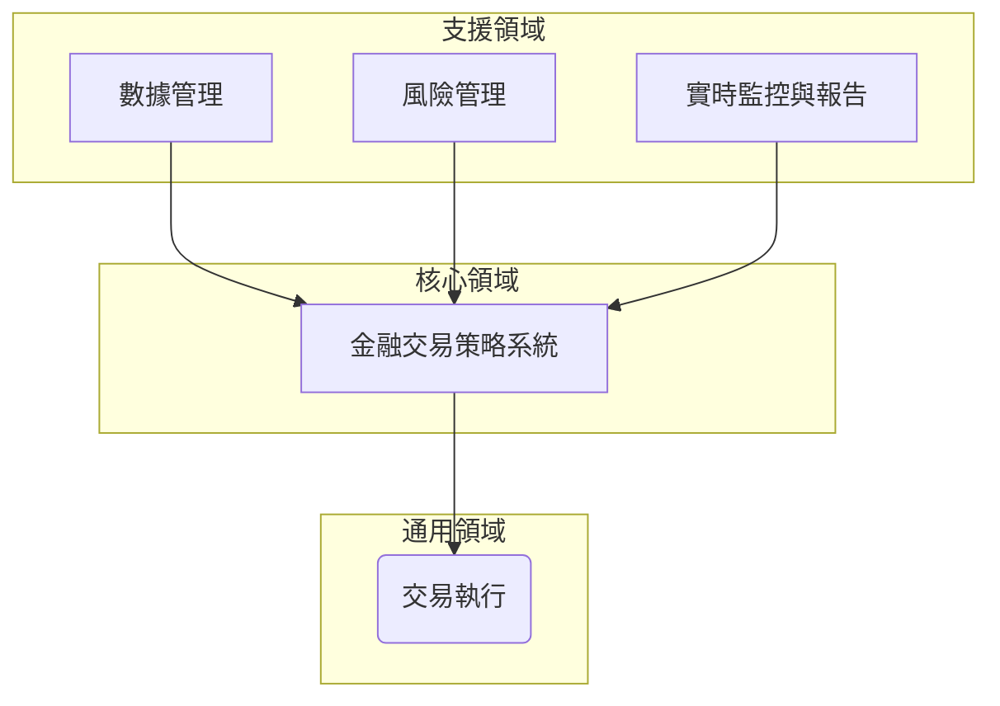

# Domain-Driven Design

## Problem Space

1. **缺乏有效的金融市場數據源：** 可能難以獲取可靠的金融市場數據來支持策略開發和回測。

2. **數據分析複雜性：** 分析金融市場數據可能複雜，需要使用統計分析或機器學習技術來識別交易機會。

3. **交易執行不及時：** 交易執行可能受限於市場的波動性和交易所的執行速度，可能無法及時執行交易訂單。

4. **風險管理困難：** 管理風險可能是一個挑戰，特別是在快速變動的市場環境中。

5. **實時監控需求：** 交易策略需要實時監控市場變化，以及策略的表現情況。

## Solution Space

### 核心領域（Core Domain）：

#### 金融交易策略系統（Strategy）：

這是整個專案的核心，旨在開發一個功能強大的金融交易策略系統，用於識別、開發和執行各種交易策略，並進行回測和實時監控。該系統將包括策略開發與回測功能。

### 支援領域（Supporting Domain）：

#### 數據管理（Feed）：

負責管理和整合來自不同數據源的金融市場數據，包括股價、交易量等，以供策略開發和分析使用。

#### 風險管理（Risk）：

負責評估、監控和管理交易策略可能面臨的各種風險，包括市場風險、信用風險等。

#### 實時監控與報告（Monitoring）：

負責實時監控市場變化、交易策略執行情況，並生成相應的報告用於評估和分析。

### 通用領域（Generic Domain）：

#### 交易執行（Trade）：

負責生成和執行交易訂單，將交易策略轉換為實際交易行動。

